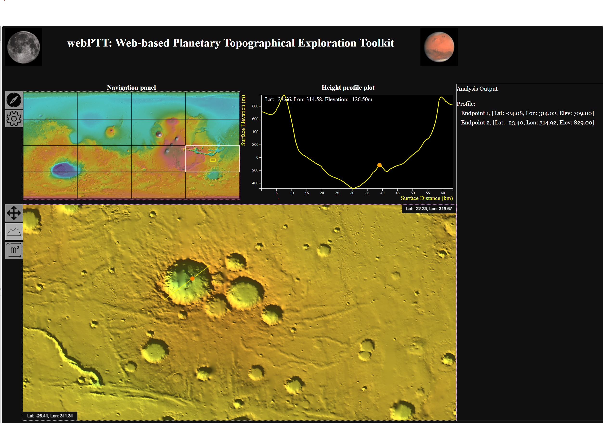

# WebPTT

Web-based Visualization and Analysis of NASA Planetary Topography Data Sets

## webPTT Overview
webPTT is a web application designed for the visualization and analysis of planetary topography data sets provided by NASA. It allows users to interactively explore high-resolution topographic maps, perform data analysis, and generate visualizations for research and educational purposes.    
## Features
- Interactive 2D and 3D visualization of planetary topography data.
- Support for multiple planetary bodies including Mars (MOLA) and Moon (LOLA).
- Data analysis tools for elevation profiling, slope calculation, and volume estimation.
- Export options for selected region(s) in CSV format.
- User-friendly interface with customizable visualization settings.
## Installation
No installation is required. webPTT is a web-based application and can be accessed directly through a web browser. Simply navigate to the hosted URL to start using the application.
## Usage
1. Open your web browser and webPTT will automatically load the default planetary topography (LOLA) data set.
2. Use the navigation tools to explore the topographic map.
3. Select analysis tools from the tool sidebar to perform various data  analyses.
4. Export your results using the export options available from the sidebar.
## Notes
- Ensure you have a stable internet connection for optimal performance.
- For best results, use modern web browsers such as Google Chrome, Mozilla Firefox, or Microsoft Edge.
- WebPTT downloads data directly from NASA servers; please be mindful of data usage policies.
- This application is intended for educational and research purposes only.
- A CORS plugin is required to load data from NASA servers.
## License
This project is licensed under the GPL-3.0 License. See the LICENSE file for details.
## Acknowledgments
This material is based upon work supported by National Aeronautics and Space Administration under Grant No. 80NSSC20K0503 issued through the HPOSS ROSE-2022. Any findings, and conclusions or recommendations expressed in this material are those of the author(s) and do not necessarily reflect the views of the National Aeronautics and Space Administration.